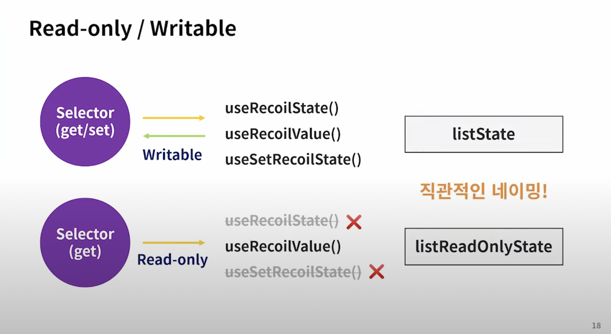

## recoil basic  

### Recoil Root
> 루트 컴포넌트에 넣으면 좋음

### Atom
- state의 일부

> 상태의 일부, 어디서나 읽고 쓸 수 있음\
> 아톰 변화 -> 해당 아톰을 구독하는 컴포넌트들 재렌더링 

### Selector
- derived state의 일부

> 파생된 상태의 일부\
> 파생된 상태: 상태의 변화!\
> 즉, 다른 데이터에 의존하는 다른 데이터를 만들 수 있음\
> 컴포넌트 입장에서는 atom 읽을 때와 같은 hook으로 selector 또한 읽을 수 있지만, 어떤 훅은 writable state 에만 쓸 수 있음(`useRecoilState`) 

✏️ 모든 atom은 writeable state, but not all selctors are writable state (get, set 프로퍼티 가지는 selectors)




✅ `useRecoilState` 는 마치 `useState`와 같다. 첫번째 원소는 상태, 두번째 원소는 상태를 업데이트 하는 함수 반환\
✅ 업데이트 함수가 필요없고 상태값만 필요하다면 `useRecoilValue` 훅을 사용할 \
✅ 업데이트 함수만 필요하다면 `useRecoilState`

### 비동기 데이터 쿼리 
> 비동기의 경우 async 함수를 사용하여 프로미스를 리턴하기만 하면 된다\
dependency가 변경되면 selector가 새로운 쿼리를 실행한다.\
결과는 기본적으로 캐시되고, input이 변하지 않는한 새로 요청되지 x\
==> 매번 새로 요청해야 할 경우 unique input을 계속 만들어주거나 해야함\
(refresh 관련 훅도 있는데 아직 unstable)

✏️ 하지만, 리액트 렌더 함수는 동기적이다. 그렇다면 프로미스 전에 어떤게 렌더되는 가?\
리코일은 데이터 통신에서 `React Suspense`를 같이 쓰라고 함\
앱 전체를 Suspense 로 감싸서, pending이나 fallback UI를 렌더링 할 수 있도록 !

#### 에러 핸들링 
> 그런데 요청이 에러가 있다면?\
> selector가 에러를 던질 수 있음 -> 리액트 에러 바운더리에서 잡아냄

#### 결국 리코일은 에러 바운더리랑 서스펜스랑 같이 써야겠군요?
> It is not necessary to use React Suspense for handling pending asynchronous selectors. You can also use the useRecoilValueLoadable() hook to determine the current status during rendering... 

#### 파라미터가 있는 쿼리
> 파생된 상태가 아닌 파라미터의 쿼리를 던지고 싶다면?(컴포넌트 prop으로 받는 등)\
> `selectorFamily()` 헬퍼를 사용하면 됨

```js
const userNameQuery = selectorFamily({
  key: 'UserName',
  get: userID => async () => {
    const response = await myDBQuery({userID});
    if (response.error) {
      throw response.error;
    }
    return response.name;
  },
});

```

### 데이터 플로우 그래프
> data-flow graph

### concurrent request 
> expensive한 경우 `waitForAll`과 같은 헬퍼 사용 (arry, object dependency 가능)

### pre-fetching
> 렌더링 되기전 fetching
